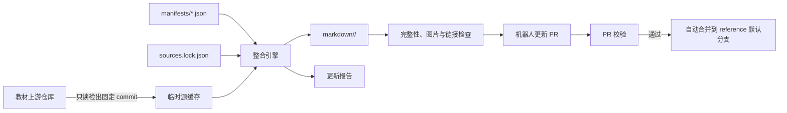
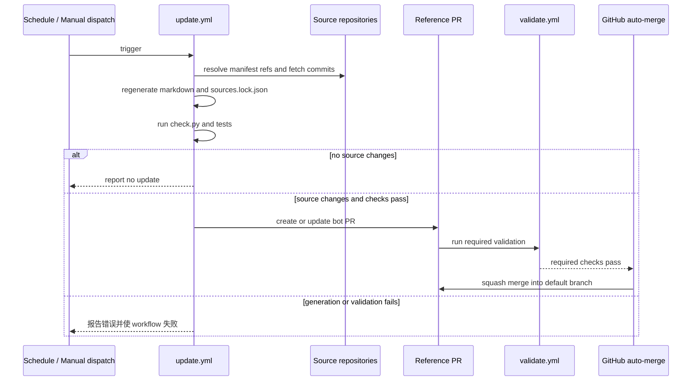

# 多仓库 Markdown 整合与自动更新技术方案

## 文档信息

| 项目 | 内容 |
| --- | --- |
| **文档标题** | 多仓库 Markdown 整合与自动更新技术方案 |
| **文档版本** | v0.4 |
| **创建日期** | 2026-09-14 |
| **更新日期** | 2026-09-15 |
| **文档作者** | Codex |
| **文档类型** | 技术设计 |
| **参考资料** | `ai-agent-book`、`easy-rl` 的现有单文件 Markdown 生成实践 |

## 目录

- [目标与范围](#目标与范围)
  - [目标](#目标)
  - [非目标](#非目标)
- [总体架构](#总体架构)
- [仓库结构与职责](#仓库结构与职责)
- [参考源与版本锁定](#参考源与版本锁定)
  - [清单](#清单)
  - [锁文件](#锁文件)
  - [本地与 CI 获取策略](#本地与-ci-获取策略)
- [生成与检查契约](#生成与检查契约)
  - [生成规则](#生成规则)
  - [图片和链接规则](#图片和链接规则)
  - [检查规则](#检查规则)
- [自动更新与自动合并](#自动更新与自动合并)
  - [工作流](#工作流)
  - [自动合并门槛](#自动合并门槛)
  - [GitHub 配置](#github-配置)
- [安全与失败处理](#安全与失败处理)
- [实施顺序与验收](#实施顺序与验收)

## 目标与范围

### 目标

`reference` 是多本技术书的只读参考、Markdown 整合和发布中心。每本教材仓库只提供源内容；整合脚本、锁定版本、检查逻辑和发布的完整 Markdown 都只维护在 `reference`。

系统必须满足以下条件：

- 不向教材源仓库写入脚本、生成文档、工作流或提交。
- 每份 `markdown/` 文档都能追溯到精确的源仓库 commit。
- 图片和本地文档链接固定指向该 commit，不受源分支后续变化影响。
- 定时任务发现源内容更新后，自动生成中央仓库 PR；所有门槛通过后自动合并。
- 生成失败、目录遗漏、链接不合法或源仓库不可用时，保留当前已发布版本，不自动合并。

### 非目标

- 不替代或修改教材原作者的构建、翻译、发布和 CI 流程。
- 不执行参考仓库中的脚本、安装其依赖或运行其示例代码。
- 不把教材完整源代码镜像提交到 `reference`。
- 不自动向上游仓库发 PR；需要向上游贡献时，使用独立的人工工作流。

## 总体架构



整合引擎只读取清单声明的文件。清单定义阅读顺序、标题、语言、输出路径和渲染配置；默认的 `generic` 适配器配合共享引擎处理 Markdown、链接、图片和静态 HTML 正文。只有确有无法通用化的来源格式时才增加版本化适配器。这样新增专栏通常只需新增清单，而不是新增脚本。通用 Markdown 重写、链接校验和锁文件读写由共享引擎负责。

## 仓库结构与职责

```text
reference/
├── adapters/
│   └── __init__.py              # 每本书的版本化兼容声明
├── manifests/                   # 人工维护的来源和内容清单
│   ├── ai-agent-book.json
│   ├── ai-infra-book.json
│   ├── easy-rl.json
│   ├── hello-agents.json
│   ├── lianglianglee-architecture.json
│   ├── lianglianglee-continuous-delivery.json
│   ├── lianglianglee-distributed-finance.json
│   ├── lianglianglee-flutter.json
│   ├── lianglianglee-high-concurrency.json
│   ├── lianglianglee-http.json
│   ├── lianglianglee-instant-messaging.json
│   ├── lianglianglee-kafka.json
│   ├── lianglianglee-left-ear.json
│   ├── lianglianglee-linux-performance.json
│   ├── lianglianglee-mysql.json
│   └── lianglianglee-recommendation-system.json
├── markdown/                    # 对外发布的完整 Markdown，纳入版本控制
│   ├── ai-agent-book/
│   │   └── zh-CN-complete.md
│   ├── ai-infra-book/
│   │   └── zh-CN-complete.md
│   ├── easy-rl/
│   │   └── zh-CN-complete.md
│   ├── hello-agents/
│   │   └── zh-CN-complete.md
│   └── geektime/
│       ├── AI技术内参.md
│       ├── Flutter核心技术与实战.md
│       ├── Kafka核心技术与实战.md
│       ├── Linux性能优化实战.md
│       ├── MySQL实战45讲.md
│       ├── 分布式金融架构课.md
│       ├── 即时消息技术剖析与实战.md
│       ├── 从0开始学架构.md
│       ├── 左耳听风.md
│       ├── 持续交付36讲.md
│       ├── 推荐系统三十六式.md
│       ├── 透视HTTP协议.md
│       └── 高并发系统设计40问.md
├── reports/                     # 可选的已审阅报告；临时报告不提交
├── tests/
├── tools/
│   ├── update.py                # 发现新源 commit、生成并更新 lock
│   ├── check.py                 # 无写入检查入口
│   ├── reference_core.py        # 清单、锁和通用重写逻辑
│   └── source_cache.py          # 只读检出与缓存管理
├── .github/workflows/
│   ├── validate.yml             # PR 校验
│   └── update.yml               # 定时/手动更新和自动合并
├── .gitignore                   # 忽略 .cache/、.reports/ 和本地配置
└── sources.lock.json            # 已发布文档对应的精确源版本
```

`markdown/` 是发布物，不是临时目录。`tools/update.py` 是唯一允许改写 `markdown/` 和 `sources.lock.json` 的入口。`tools/check.py` 不修改工作树，因此可安全用于 PR、预提交和巡检。

## 参考源与版本锁定

### 清单

每本书使用一个 JSON 清单描述稳定的人工决策。JSON 是 Python 标准库可直接解析的格式，避免更新和检查命令依赖第三方配置解析器。清单不记录瞬时 commit，只记录“跟踪哪个仓库、哪个分支、哪些文件及其顺序”。来源为普通 Markdown 时可省略 `adapter`，默认使用 `generic`；静态站点导出的文章则声明正文容器，交由通用 HTML 抽取器转换。示例：

```json
{
  "id": "ai-agent-book",
  "source": {
    "repository": "https://github.com/bojieli/ai-agent-book.git",
    "ref": "main"
  },
  "language": "zh-CN",
  "output": "markdown/example/zh-CN-complete.md",
  "render": {
    "source_format": "html_article",
    "article_class": "book-post"
  },
  "sections": [
    {
      "title": "正文",
      "selection": {
        "include_globs": ["book/专栏/示例/*.md"],
        "exclude_paths": ["book/专栏/示例/宣传文.md"]
      }
    }
  ],
  "completeness": {"required_globs": ["book/专栏/示例/*.md"]}
}
```

清单中的仓库地址必须处于代码审查过的允许列表。章节可以使用 `parts` 精确列出文件和人工阅读顺序，也可以使用 `selection.include_globs` 选择同一目录下的文件并按自然文件名排序；后者适合编号专栏。一个清单可以声明多个主题章节，生成时依次成为二级标题，篇目成为三级标题，避免长文档只有一个“正文”章节。`exclude_paths` 是明确的人工排除清单，例如宣传文；它仍受 `required_globs` 覆盖，因此新增内容不会被静默遗漏。`render.source_format: html_article` 要求同时声明 `article_class`，引擎只提取对应容器，不把导航、页脚或 favicon 等站点外壳带入整合文档。

### 锁文件

`sources.lock.json` 是发布输入的不可变快照。它记录每份当前 Markdown 实际使用的 commit，而不是只记录正在跟踪的分支。示例：

```json
{
  "version": 1,
  "sources": {
    "ai-agent-book": {
      "repository": "https://github.com/bojieli/ai-agent-book.git",
      "ref": "main",
      "commit": "0123456789abcdef0123456789abcdef01234567",
      "commit_date": "2026-09-14T02:20:00Z",
      "generator_version": "1"
    }
  }
}
```

锁文件提供四项能力：

- **可复现**：重新执行生成器时检出 lock 中的 commit，得到相同的源输入和图片链接。
- **可审计**：读者可从 Markdown frontmatter 和锁文件追溯来源、分支和 commit。
- **差异判断**：更新任务能准确区分“上游 `main` 有新 commit”和“中央 Markdown 没有重建”。
- **回滚**：回滚 `sources.lock.json` 与对应 `markdown/` 文件即可恢复上一份可发布版本。

### 本地与 CI 获取策略

本地开发可显式使用已有源码 checkout 的共同父目录，例如源仓库位于 `../lianglianglee` 时使用 `--source-root ..`。该模式只验证和读取工作树，拒绝脏工作树，且不执行 fetch、checkout、reset 或任何写入操作。

CI 与标准更新命令使用 `reference/.cache/sources/<owner>--<repository>/` 作为 Git 忽略的缓存目录。同一上游仓库的多份整合文档共享一个 Git 对象缓存，并依次以 detached HEAD 稀疏检出各自所需文件；不使用开发者工作区的绝对路径。缓存目录可随时删除并重建。

缓存只稀疏检出清单解析后的 Markdown 源文件；同时读取锁定提交的 Git 树元数据来确认本地图片、目录和证据链接的类型。生成 Raw 或 GitHub 链接不需要下载对应图片、PDF、绘图脚本或 vendored 资源，因此资源与正文混放的上游仓库也不会扩大缓存规模。

## 生成与检查契约

### 生成规则

`python3 tools/update.py --all` 对每个清单执行以下步骤：

1. 读取远端 ref 的最新 commit；若与 lock 相同，跳过该书。
2. 在缓存中检出新 commit 的清单源文件，并建立该 commit 的 Git 树索引。
3. 运行通用引擎；仅在清单显式选择时再运行对应适配器，生成 `markdown/<book>/` 文件。
4. 在 Markdown frontmatter 写入读者元信息（标题、作者、语言、标签和首末发布日期）；来源、锁定提交和生成器版本写入正文的文档信息表与 `sources.lock.json`。
5. 写入新的 `sources.lock.json`，然后运行全部检查。

`python3 -m tools.update --target ai-agent-book` 只更新一份书。`--dry-run` 只报告待更新的 commit 和目标文件，不写工作树。

### 图片和链接规则

所有生成器必须遵循同一规则：

- 相对图片路径必须存在于锁定提交的 Git 树中，并改写为 `https://raw.githubusercontent.com/<owner>/<repo>/<commit>/<path>`。
- 相对 Markdown、目录和报告链接按 Git 树中的 blob/tree 类型改写为 `https://github.com/<owner>/<repo>/blob/<commit>/<path>` 或 `tree/<commit>/<path>`。
- 外部 `https:`、锚点、`mailto:` 和 `data:` 链接保持不变。
- Markdown 图片、Pandoc 图片属性、HTML ``、居中 `div`、`figure` 和 `figcaption` 都转换为标准 Markdown 图片和正文标题；静态 HTML 专栏仅转换所声明文章容器内的正文。
- 若上游将尺寸参数保存在真实文件名中（例如 `diagram.png?wh=1740*733`），引擎先按普通 URL 查询参数解析，找不到资源时再按 Git 树中的字面文件名解析，并对 Raw URL 正确编码。
- 若静态站点遗留了已移动副本的相对图片路径，且锁定 Git 树中同名 blob 唯一，引擎会回退到该 blob；存在同名歧义时拒绝生成，避免错误替换资源。
- 对带未转义方括号等无法被 URL 解析器读取的第三方外链，保留原始链接继续生成；仅能确认属于当前上游仓库的合法 URL 才会固定到 commit。
- 目标位于源仓库外、源文件不存在或 URL 方案不在允许列表时，生成失败。

使用 commit SHA 而不是 `main` 或 `master` 是强制要求。分支会移动，而已发布文档中的图片和来源不能移动。

### 检查规则

`python -m tools.check --all` 至少执行以下检查：

| 类别 | 验收条件 |
| --- | --- |
| 清单完整性 | 每个声明源文件存在、只出现一次，且所有 `required_globs` 的文件都已被收录 |
| 生成新鲜度 | 对 lock 中 commit 重建后，输出与 `markdown/` 中的受控文件逐字一致 |
| 资源可移植性 | 不残留相对图片、本地绝对路径、HTML 图片容器或可解析但不存在的资源 |
| 链接有效性 | 重写后的内部链接符合锁定 commit 与仓库路径；外部链接仅做语法检查，不依赖网络成功 |
| Markdown 结构 | 仅一个一级标题、目录锚点可解析、标题层级不跳跃、无行尾空白 |
| 安全边界 | 所有输入仓库、输出路径和适配器均来自清单允许列表；不执行参考源代码 |

## 自动更新与自动合并

### 工作流

`update.yml` 每周日 02:20 UTC（上海时间周日 10:20）定时执行，也支持 `workflow_dispatch` 手动触发。定时任务的目标是创建或更新一条“来源同步”PR；它不直接向默认分支提交。

```yaml
on:
  schedule:
    - cron: "20 2 * * 0"
  workflow_dispatch: {}
```



PR 校验由 `validate.yml` 执行，触发条件为修改 `manifests/**`、`tools/**`、`adapters/**`、`markdown/**`、`sources.lock.json`、`tests/**` 或工作流文件。它运行 `tools/check.py --all` 与单元测试，但不访问未经清单授权的来源。

### 自动合并门槛

自动合并仅适用于机器人创建的来源同步 PR，且必须同时满足以下条件：

- PR 分支名符合 `automation/source-sync-*`。
- PR 作者是配置的 GitHub App，而不是普通用户或 `GITHUB_TOKEN`。
- 文件变更仅限 `sources.lock.json` 和 `markdown/**`；`manifests/`、`tools/`、`adapters/`、测试和 workflow 的变化必须人工审查。
- `update.yml` 已在同一提交上完成生成与检查，`validate.yml` 的全部必需检查也成功。
- 默认分支启用线性历史或 squash merge，且仓库启用 GitHub 的 auto-merge。
- 同一时间只允许一个来源同步 PR；并发任务使用 `concurrency: source-sync` 取消旧任务。

满足条件后，更新任务调用 `gh pr merge --auto --squash`。GitHub 在 required checks 全部成功后再实际合并；任何检查失败、分支保护不满足或 PR 被人工标记为 draft 时，自动合并不会执行。

### GitHub 配置

为避免 `GITHUB_TOKEN` 创建的 PR 不触发后续 PR 工作流，更新任务使用一个最小权限 GitHub App token 创建分支和 PR。该 App 只授予 `reference` 仓库以下权限：

| 权限 | 用途 |
| --- | --- |
| Contents: Read and write | 创建同步分支并提交 `markdown/` 与 lock 文件 |
| Pull requests: Read and write | 创建、更新并请求自动合并 PR |
| Actions: Read | 读取必需检查状态 |

GitHub 仓库设置需要启用 Allow auto-merge，并将 `validate.yml` 的检查设为默认分支保护的 required status checks。若参考源包含私有仓库，使用只读 deploy key 或只读 GitHub App installation token；该凭据不授予目标源仓库写权限。

## 安全与失败处理

- 更新过程只克隆清单允许的 HTTPS 或 SSH 仓库，不接受 PR 输入的任意 URL。
- 参考源中的 Python、Shell、Makefile、Git hooks 和 CI 配置永不执行；系统仅解析声明的 Markdown 与资源路径。
- 缓存和临时目录位于 `reference/.cache/` 或系统临时目录，均不纳入版本控制；清理缓存不影响教材源仓库。
- 单本书获取、解析或检查失败时，任务退出非零并生成诊断报告；其他书的当前已发布 Markdown 保持不变。
- 源分支被 force-push 或目标 commit 不可获取时，拒绝更新 lock，不以“最新分支内容”替代锁定版本。
- 自动合并前重新读取 PR head SHA 和文件白名单，防止 PR 在检查完成后被插入非生成内容。

## 实施顺序与验收

1. 初始化目录、共享引擎、清单和锁文件数据模型；实现 `check.py` 的路径、清单和 lock 校验。
2. 迁入 `ai-agent-book` 适配器，复用已验证的 Markdown、HTML 图片、Pandoc 属性和链接重写规则；生成第一份中央 Markdown。
3. 添加 `easy-rl` 适配器，确认共享引擎可覆盖两本书的图片和标题差异。
4. 为适配器、锁文件、图片重写、漏章检测和 dry-run 添加单元测试。
5. 添加 `validate.yml`，使人工 PR 和机器人 PR 均须通过无写入检查。
6. 添加 `update.yml`、GitHub App token、PR 白名单和 auto-merge；先以手动触发验证，再启用每周定时任务。

验收完成的标准是：在不修改任何教材源仓库的前提下，手动或定时任务能检测一个源仓库的新 commit，生成包含固定 commit 图片链接的中央 Markdown，创建仅改动允许文件的 PR，并在 required checks 成功后自动 squash merge。
